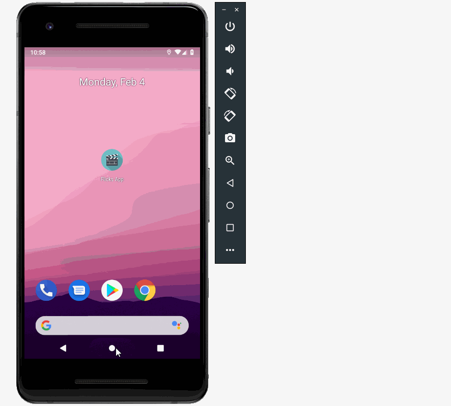

# Flicks
Flicks is an app that allows users to browse movies from the [The Movie Database API](http://docs.themoviedb.apiary.io/#).

## Flix Part 2

### User Stories

#### REQUIRED (10pts)

- [x] (8pts) Expose details of movie (ratings using RatingBar, popularity, and synopsis) in a separate activity.
- [x] (2pts) Allow video posts to be played in full-screen using the YouTubePlayerView.

#### BONUS

- [x] Trailers for popular movies (rated 7 stars or greater) are played automatically when the movie is selected (1 point).
  - [x] When clicking on a popular movie the video should be played immediately.
  - [x] Less popular videos rely on the detailed page should show an image preview that can initiate playing a YouTube video. (The YouTube player seems to fulfill this with its thumbnail image.)
- [x] Add a play icon overlay to popular movies to indicate that the movie can be played (1 point). (Again, the youtube player has this.)
- [ ] Apply the popular ButterKnife annotation library to reduce view boilerplate. (1 point)
- [x] Add a rounded corners for the images using the Glide transformations. (1 point)

- [x] (Personal goal) Added ability to search for movies using a searchbar and The Movie Databases search endpoint.

### App Walkthough GIF

### Notes

The Glide module presented many questions that led to a lot of googling. The search function wasn't too bad, but pushed me to google things like how to auto-scroll to the top of a RecyclerView when new data was loaded.

## Flix Part 1

#### REQUIRED (10pts)
- [x] (10pts) User can view a list of movies (title, poster image, and overview) currently playing in theaters from the Movie Database API.

#### BONUS
- [x] (2pts) Views should be responsive for both landscape/portrait mode.
   - [x] (1pt) In portrait mode, the poster image, title, and movie overview is shown.
   - [x] (1pt) In landscape mode, the rotated alternate layout should use the backdrop image instead and show the title and movie overview to the right of it.

- [x] (2pts) Display a nice default [placeholder graphic](https://guides.codepath.com/android/Displaying-Images-with-the-Glide-Library#advanced-usage) for each image during loading
- [x] (2pts) Improved the user interface by experimenting with styling and coloring.

### Open-source libraries used

- [Android Async HTTP](https://github.com/loopj/android-async-http) - Simple asynchronous HTTP requests with JSON parsing
- [Glide](https://github.com/bumptech/glide) - Image loading and caching library for Androids
